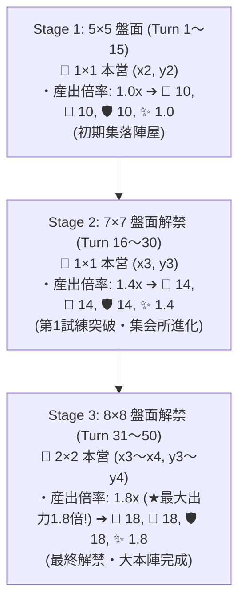

# 03. 土地システム概要

## 基本構造
- **1マスの基本単位**: **`5`** (1マスあたりの基礎数値)
- **リニア計算規則**: ブロック全体の合計産出は **`1マスあたりの産出 (ベース 5) × マス数`** で計算される。

---

## 🌊 【確定仕様】川 (本流 ＆ 源流) の自動発見システム (1プレイ1回限定)

手札からの独立水域「湖」のドローは完全削去されました。川・源流は**本営から3マス離れた奥地へ2マス以上のブロックを配置した際、1プレイ（1ゲーム）につき最大1回のみ自動発見**されます。

```mermaid
graph TD
    PlaceBlock["未配置グリッドへ 2マス以上のブロックを配置"] --> CheckDistance{"本営からの距離は<br>3マス以上離れているか？"}
    
    CheckDistance -->|No (距離 1〜2)| NoRiver["発見判定なし"]
    CheckDistance -->|Yes (距離 3以上)| CheckOnce{"このプレイで既に<br>川を発見済みか？"}
    
    CheckOnce -->|Yes (発見済み)| NoRiver
    CheckOnce -->|No (未発見)| RollRiver["🌊 川/源流の発見確率ロール実行!"]
    
    RollRiver -->|一般ブロック| Chance1["本流: 2.0% / 源流: 0.0%"]
    RollRiver -->|丘陵ブロック| Chance2["本流: 4.0% / 源流: 0.1%"]
    RollRiver -->|山岳ブロック| Chance3["本流: 6.0% / 源流: 0.3% (山岳特化!)"]
```

### 📋 1プレイ1回限定：川 (本流 / 源流) 発見確率マトリクス

| 配置したブロックの判定 | 本営からの距離 | ブロックサイズ | **本流 の発見確率** | **源流 の発見確率** | 1プレイあたりの発見上限 |
| :---: | :---: | :---: | :---: | :---: | :---: |
| **一般ブロック (平地等)** | **3マス以上** | **2マス以上** | **`2.0 %`** | **`0.0 %`** (発見不可) | **1回限定** |
| **⛰️ 丘陵ブロック** | **3マス以上** | **2マス以上** | **`4.0 %`** | **`0.1 %`** (基準確率) | **1回限定** |
| **🏔️ 山岳ブロック** | **3マス以上** | **2マス以上** | **`6.0 %`** | **`0.3 %`** (丘陵の3倍!) | **1回限定** |

---

## 🚫 湖カードのドロー完全削去
* 独立水域「湖」カードは手札ドローの対象から完全に除外されました。
* 湖・水域は上記の「川・源流発見イベント」によってのみ盤面に湧き出ます。

---

## 🏰 【確定仕様】盤面拡大 (Stage) ✕ 本営産出の段階的強化 (最大 1.8x カーブ)

盤面の解禁拡大（Stage 1 ➔ Stage 2 ➔ Stage 3）に伴い、本営の基本産出が**最大出力 1.8倍に収まるカーブ（1.0x ➔ 1.4x ➔ 1.8x）**で強化されます。



---

## 🏛️ 盤面サイズ (奇数/偶数) ✕ 本営 (完全中央配置) 相関仕様

* **Stage 1 (5×5 奇数盤面)**: `1×1 本営` (中心 `x2, y2` / 左右上下2マス対称)
* **Stage 2 (7×7 奇数盤面)**: `1×1 本営` (中心 `x3, y3` / 左右上下3マス対称・ズレゼロ!)
* **Stage 3 (8×8 偶数盤面)**: `2×2 本営` (中心 `x3〜x4, y3〜y4` / 左右上下3マス対称)

---

## 📐 地形別 限定出現ブロック形状パターン (平地・丘陵・山岳)

* **🌾 平地**: 全9形状が出現 (1×1 C 〜 2×2 L)
* **⛰️ 丘陵**: **【限定3パターンのみ出現】** `1×2 直線 (UC)`, `1×3 L字 (UC)`, `1×4 靴型 (R)`
* **🏔️ 山岳**: **【限定3パターンのみ出現】** `1×4 凸型 (R)`, `1×3 直線 (UC)`, `1×4 直線 (R)`

---

## 🔒 盤面拡大 (Stage) ✕ レアリティ (C, UC, R, L) 出現制限

* **Stage 1 (5×5)**: `C (1×1)`, `UC (1×2, 1×3)` のみドロー出現
* **Stage 2 (7×7)**: **🔓 `R` レアリティ (1×4 各種)** が解禁・ドロー出現
* **Stage 3 (8×8)**: **🔓 `L` レアリティ (2×2 正方形)** が解禁・ドロー出現

---

## 📐 高度合計値 ✕ 閾値判定による土地分類 (平地・丘陵・山岳)

| ブロックサイズ | 高度合計値 `Sum` | 平均高度 `Avg` | 確定する土地属性 | 図面適用例 |
| :---: | :---: | :---: | :---: | :--- |
| **3マス** | **`3 〜 4`** | `1.00 〜 1.33` | **🌾 平地** | `1 + 1 + 1 = 3` / `1 + 1 + 2 = 4` |
| **3マス** | **`5 〜 7`** | `1.67 〜 2.33` | **⛰️ 丘陵** | `1 + 2 + 3 = 6` ➔ ⛰️ 丘陵 |
| **3マス** | **`8 〜 9`** | `2.67 〜 3.00` | **🏔️ 山岳** | `2 + 3 + 3 = 8` / `3 + 3 + 3 = 9` |
| **4マス** | **`4 〜 5`** | `1.00 〜 1.25` | **🌾 平地** | `1 + 1 + 1 + 1 = 4` / `1 + 1 + 1 + 2 = 5` |
| **4マス** | **`6 〜 8`** | `1.50 〜 2.00` | **⛰️ 丘陵** | `1 + 1 + 2 + 2 = 6` / `1 + 2 + 2 + 3 = 8` |
| **4マス** | **`9 〜 12`**| `2.25 〜 3.00` | **🏔️ 山岳** | `1 + 2 + 3 + 3 = 9` ➔ 🏔️ 山岳 |

---

## 🏔️ 高度差によるブロック配置制限 (物理制約)

* **「隣接高度差 ≦ 1」規則**: 盤面上の隣り合う任意の2マスの高度差は常に `1` 以下 (`|高度A - 高度B| ≦ 1`)。
* **断崖絶壁の配置禁止**: 高度1の真隣に高度3を直接接して置くような「高度差2以上（1➔3）」の垂直絶壁は配置不可。

---

## 🤝 【現行検討案とのコンペア＆すり合わせ追記】

* **Civ式 境界線（エッジ）流路モデル**:
  発見された川はマス内ではなくマスの「境界線（ヘリ）」を3〜6辺走り、接する両側の陸地に **`🌾 食料 +50%`** の水利バフを適用。
* **Rキー 90度回転パズル**:
  ドローしたブロックカードを手札選択時にRキーで90度回転させ、凹凸や境界線川にピッタリはめ込むプレイスタイルへ流用・統合。
