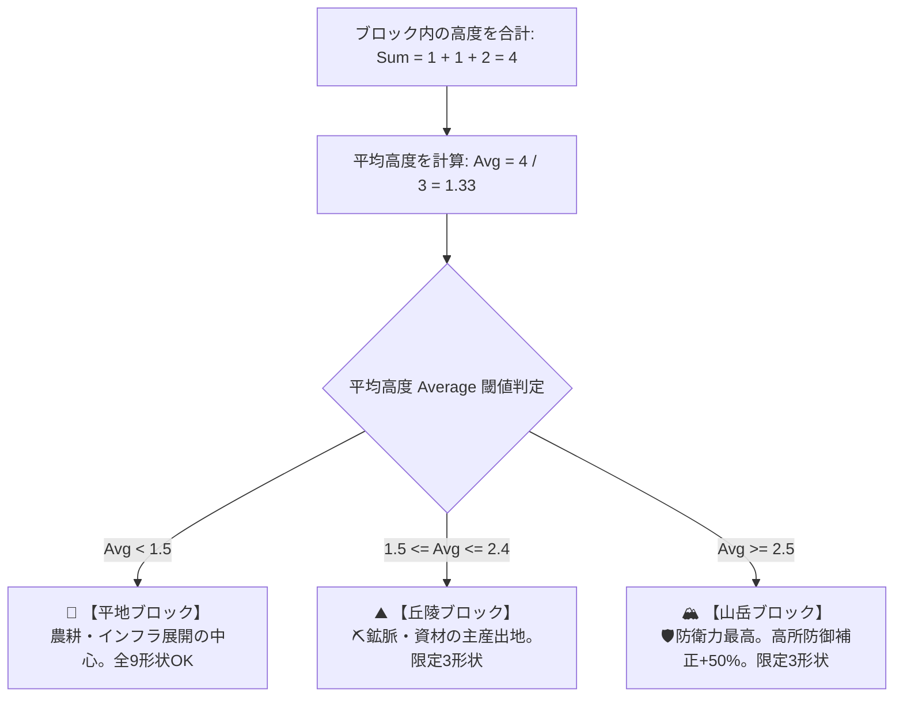

# 03. 土地システム概要（高度 ✕ ブロック形状 確定全仕様）

## 📐 1. 基本構造 ＆ 1マス比例計算
- **1マスの基本単位**: **`5`** (1マスあたりの基礎数値)
- **リニア計算規則**: ブロック全体の合計産出は **`1マスあたりの産出 (ベース 5) × マス数`** で計算される。

---

## 🏔️ 2. 高度階層 (Elevation 1〜3) ＆ 「隣接高度差 ≦ 1」物理制約

* **高度 1 (平地/低地)**: インフラ・農耕展開の中心 (`防衛倍率 1.0x`)
* **高度 2 (丘陵/高地)**: ⛏️鉱脈・資材 🧱 の主産出地 (`防衛倍率 1.5x`)
* **高度 3 (山岳/最高峰)**: 🛡️防衛力特化・要塞拠点 (`高所補正 🛡️ +50% / 防衛倍率 2.0x`)
* **「隣接高度差 ≦ 1」規則**:
  ブロック内および盤面上の隣り合う任意の2マスの高度差は常に `1` 以下 (`|高度A - 高度B| ≦ 1`)。
  `1 ➔ 3` の垂直な絶壁は配置不可。必ず `1 ➔ 2 ➔ 3` のなだらかな傾斜グラデーションを保持。

---

## 📊 3. 高度合計値 `Sum` ✕ 平均高度 `Average` 閾値判定メカニクス

ブロック全体の高度合計値 `Sum` から **平均高度 `Average = Sum / マス数`** を算出し、以下の閾値で土地属性を一元判定します。

### 📋 高度合計値 `Sum` ✕ 分類判定テーブル

| マス数 | 高度合計値 `Sum` | 平均高度 `Average` | 確定する土地分類 | 構成例 | 図面出現制限 |
| :---: | :---: | :---: | :---: | :--- | :--- |
| **3マス** | **`3 〜 4`** | `1.00 〜 1.33` | **🌾 平地** | `1, 1, 1` (Sum 3) / `1, 1, 2` (Sum 4) | 全形状出現可 |
| **3マス** | **`5 〜 7`** | `1.67 〜 2.33` | **⛰️ 丘陵** | `1, 2, 2` / `1, 2, 3` (Sum 6) | 限定3パターンのみ |
| **3マス** | **`8 〜 9`** | `2.67 〜 3.00` | **🏔️ 山岳** | `2, 3, 3` (Sum 8) / `3, 3, 3` (Sum 9) | 限定3パターンのみ |
| **4マス** | **`4 〜 5`** | `1.00 〜 1.25` | **🌾 平地** | `1, 1, 1, 1` / `1, 1, 1, 2` | 全形状出現可 |
| **4マス** | **`6 〜 8`** | `1.50 〜 2.00` | **⛰️ 丘陵** | `1, 1, 2, 2` / `1, 2, 2, 3` | 限定3パターンのみ |
| **4マス** | **`9 〜 12`**| `2.25 〜 3.00` | **🏔️ 山岳** | `1, 2, 3, 3` / `2, 3, 3, 3` / `3, 3, 3, 3` | 限定3パターンのみ |

---

## 📐 4. 【図面確定】地形別 限定出現ブロック形状パターン

* **🌾 平地**: 全9形状が出現 (1×1 C 〜 2×2 L)
* **⛰️ 丘陵**: **【限定3パターンのみ出現】** `1×2 直線 (UC)`, `1×3 L字 (UC)`, `1×4 靴型 (R)`
* **🏔️ 山岳**: **【限定3パターンのみ出現】** `1×4 凸型 (R)`, `1×3 直線 (UC)`, `1×4 直線 (R)`

---

## 🌊 5. 川 (本流 ＆ 源流) の自動発見 ＆ Civ式 境界線流路

* **本営距離 ≧ 3** ＆ **2マス以上ブロック** で発見判定（1プレイ1回限定）。
  * 一般: 本流 2.0% / 源流 0.0%
  * 丘陵: 本流 4.0% / 源流 0.1%
  * 山岳: 本流 6.0% / 源流 0.3% (山岳特化!)
* **Civ式 境界線（エッジ）流路**: マスの境界線を3〜6辺走り、両側の陸地に **`🌾 食料 +50%`** バフを適用。
