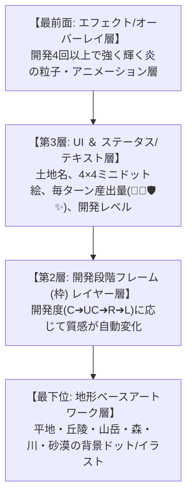

# 05. 開発（ニコイチ） ＆ カードビジュアル・レイヤー構造ルール

## 基本ルール
- **同じベース地形同士、同じレアリティ**でのみ開発可能（平地＋平地、丘陵＋丘陵など）
- 開発コスト: 🔥を**2消費**（通常の土地配置が1なので、+1の追加コスト）
- 開発すると**レアリティが1段階上昇**（C → UC → R → L）し、外見・カードフレームのレイヤーが豪華に変化する

---

## 🎨 確定仕様：カードビジュアルのレイヤー重ね合わせ構造 (Layer Structure)

土地カードは単一の画像ではなく、**複数階層の「レイヤー（Layer）」が重なり合って形成**されます。

### 🖼️ 開発段階に応じた「カードフレーム・レイヤー」の推移

1. **未開発 (0回 / 初期 C)**: 粗い木枠・土っぽい質感のベースフレーム・レイヤー
2. **開発1回 (C ➔ UC)**: 木枠に「金属の縁取り」が重ね合わされ、上質になる
3. **開発2回 (UC ➔ R)**: 「銀色の金属フレーム」がメインレイヤーとして上書き・重ね合わされる
4. **開発3回 (R ➔ L)**: 「金色の豪華フレーム」＋「炎の模様オーラ層」が前面/背景に浮き出る
5. **開発4回以上 (L 極限)**: 金枠 ＋ 最前面に「強く輝く炎の粒子・エフェクトレイヤー」がオーバーレイされる

---

## 🔍 ツールチップ ＆ 視覚フィードバック
* カードにカーソルを合わせると、ツールチップで「ベース地形」「開発回数」「産出内訳」「アタッチされている特性」を視覚的に重ねて表示。
* 一目でその土地がどれだけ強化・育成されているかを直感的に把握できる視覚演出。
