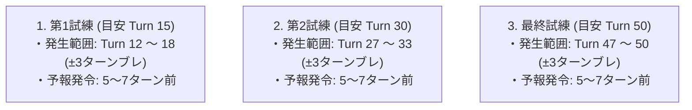
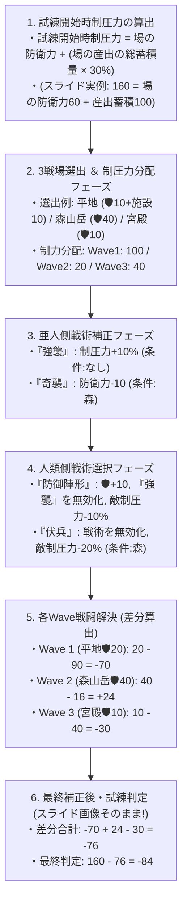

# 05. 試練の進行と戦術 (スライド画像『試練の流れ ①・②』100%完全準拠)

ユーザー様提示の公式スライド画像『試練の流れ ①・②』および確定過去ログに記載された絶対的公式ルール・数式・フェーズ進行ドキュメントです。

---

## 🎲 試練発生タイミングの確定ブレ (±3ターン) ＆ 予報アナウンス

試練は決まった固定ターンではなく、**「目安ターン ±3 ターンのブレ（揺らぎ）」** を持ってゲーム開始時に動的生成されます。また、**発生の 5〜7 ターン前に画面上へ予報アナウンスが発令** されます。

---

## ⚔️ 試練の全フェーズ進行 ＆ 計算式

---

## 🃏 確定戦術カード一覧 (スライド完全準拠)

### 1. 敵（亜人側）戦術カード
* **強襲**: 敵制圧力 +10% (条件: なし)
* **奇襲**: 防衛力 -10 (条件: 森)

### 2. プレイヤー（人類側）戦術カード
* **防御陣形**: 防衛力 `🛡️ +10` / 条件: なし / **「強襲」が使用された時、無効化 ＆ 敵制圧力 -10%**
* **伏兵**: 条件: 森 / **敵戦術を無効化 ＆ 敵制圧力 -20%**

---

## 📊 スライド画像の確定計算トレース
* **試練開始時制圧力**: `160`
* **各Waveの補正後差分**:
  - Wave 1 (平地): `20 - 90 = -70`
  - Wave 2 (森山岳): `40 - 16 = +24`
  - Wave 3 (宮殿): `10 - 40 = -30`
* **差分合計**: `-70 + 24 - 30 = -76`
* **最終数値**: `160 - 76 = -84`

---

## 🤝 【現行検討案とのコンペア＆すり合わせ追記】

* **予報アナウンスのUI同期**:
  試練発生の5〜7T前の予報発令時のみ、ヘッダー中央に赤色警告枠 `⚠️ 【試練予報】 蛮族の夜襲 まで残り X ターン` を表示し、平時は非表示。
* **盤面開拓による防衛線構築**:
  山岳ブロック (`1x4 凸`, `1x3 直線`, `1x4 直線` / 🛡️20) や軍事施設ブロックを盤面に敷き詰めることで、試練時の3戦場解決に向けた防衛力（🛡️）を蓄積・強化。
