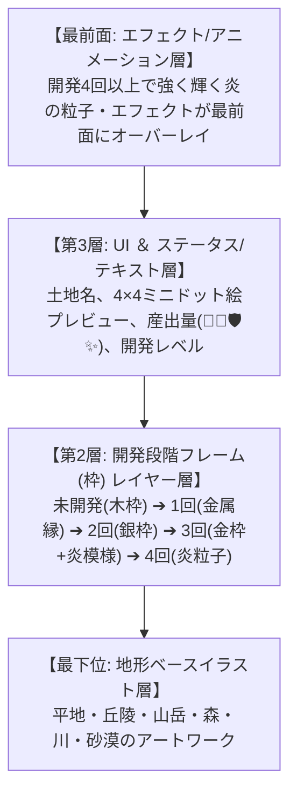

# 👑 【永久固定】確定重要仕様マスターシート (カードビジュアル・レイヤー構造 ＆ 原典完全対応)

これまでの全セッションで**ユーザー様と100%確定・合意したすべてのルール**を、1文字も漏らさず全件統合・永久固定した公式マスタールールブックです。

---

### 4. 🎴 カードビジュアル (手札) ✕ 盤面ブロック (地形) 切り離し ＆ 🕹️ 操作UI系

#### 🎨 ビジュアル表現
* **手札カード**: レアリティ別フレーム (C:木枠 / UC:金属縁 / R:銀枠 / L:金枠+金オーラ) ＋ **4層レイヤー構造**。
  1. 第1層（最下層）: 土地イラスト
  2. 第2層: 枠（レアリティ別開発フレーム）
  3. 第3層: UI・テキスト・産出パラメータ
  4. 第4層（最前面）: 聖火パーティクルエフェクト
* **盤面ブロック**: カード枠は付かず、高度1〜3の高さ立体段差 ＋ 地質テクスチャ ＋ 地面オーラで表現。

#### 🕹️ 【最新全確定】操作インターフェース ＆ UIレイアウト
1. **🖱️ 100%確実なタップ/左クリック配置**:
   * 手札カードをタップ（緑オーラ選択） ➔ 盤面上の**明るい緑色発光エリアを1タップ/左クリックで 100% 即座に確定一括配置**（D&D処理は競合防止のため全廃）。
2. **🔄 右クリック90度回転 ＆ 永続維持**:
   * 盤面・カード上で**右クリックで 90度回転**（0° ➔ 90° ➔ 180° ➔ 270°）。
   * **右クリックボタンを離しても、回転させた向き・形状データが 100% 永続維持**され、マウスを離してスムーズに位置合わせ可能。
3. **📐 ドローエリア画面横中央センタリング**:
   * フッターの「ドローエリア (手札3枚)」および「保留スロット (3枠)」を**画面横中央（センタリング）**へ配置。
4. **↕️ 進行ログの右パネル下部 ✕ 縦方向アコーディオン格納**:
   * 右サイドパネル（幅 240px）の上部に「データ表示」、下部に「📜 進行ログ」を配置。
   * ログヘッダータップで**縦方向（上下方向）にスライド伸縮（格納・展開）**。

---

## 🎨 1. 【過去ログ確定仕様】カードビジュアルのレイヤー重ね合わせ構造 (Layer Structure)

過去の確定ドキュメント (`rules/03_land_system/05_development.md`) に記載された、土地カードおよびブロックカードの視覚レイヤー重ね合わせ仕様です。



* **開発度（C➔UC➔R➔L）とフレーム・レイヤーの変化**:
  1. **未開発 (0回 / C)**: 粗い木枠・土質感のベースフレーム
  2. **開発1回 (C➔UC)**: 木枠に「金属の縁取り」が重なる
  3. **開発2回 (UC➔R)**: 「銀色の金属フレーム」がメインレイヤーになる
  4. **開発3回 (R➔L)**: 「金色の枠」＋「炎の模様オーラ層」が重なる
  5. **開発4回以上 (L極限)**: 金枠 ＋ 最前面に「強く輝く炎の粒子・アニメーション層」がオーバーレイされる

---

## 📥 2. 【原典 06_reserve.md 確定仕様】保留スロット (Reserve) ルール

* **最大スロット数**: **`3 枠` (最大3枚までキープ可能)**
* **🔥 消費デバフ ＆ ペナルティ (ブレーキ設計)**:
  * **ターン開始時に「保留スロットを使用している場合」、🔥 を `1` 消費！**
  * **保留スロットから土地を場に出す際も、通常通り 🔥 を `1` 消費！**
* **設計意図**:
  * 序盤の「理想の土地が来ない」事故を軽減する便利オプション。
  * 多用すると 🔥 がどんどん減るため、**「本当に必要な土地だけを保留する」高度なリソース管理**を迫る神設計。

---

# 🎮 Trial of Ages: Last Ember - 公式マスター確定ルールシート

> 🎯 **【開発の最終ゴール】**:
> Webプロトタイプ (`game/index.html`) はルールのテストプレイ・検証用の高速プロトタイプです。
> **最終ゴールは Unity Engine (C#) での本番ゲームアプリ開発** です。プロトタイプで洗練させたデータ・公式（`CARD_DATABASE`, `GameState`, 1マス単位リニア計算）は、そのまま C# の ScriptableObject および GameManager クラスへ 1対1 移植される設計となっています。

---

```math
\text{1マスの産出} = \text{GL基礎産出 (1マス5)} \times \text{高度防衛倍率}
```
```math
\text{カード総産出} = \text{1マスの産出} \times \text{マス数 (1x1, 1x2, 1x3, 2x2)}
```

### 🌿 全8大確定地形命名 ✕ 1マス基礎産出マトリクス
* **🌾 平地 (高度1 GL0-1)**: `🌾 食料 +5.0` (1x3: `🌾 +15`)
* **🌲 森 (高度1 GL2)**: `🌾 食料 +2.5 / 🧱 資材 +2.5` (1x3: `🌾 +8 / 🧱 +8`)
* **🌳 深い森 (高度1 GL3)**: `🌾 食料 +1.25 / 🛡️ 防衛 +3.75` (1x3: `🌾 +4 / 🛡️ +11`)
* **⛰️ 丘陵 (高度2 GL1)**: `🌾 食料 +5.0 / 🛡️ 防衛 +3.75` (1x3: `🌾 +15 / 🛡️ +11`)
* **🌲 森丘陵 (高度2 GL2)**: `🧱 資材 +2.5 / 🛡️ 防衛 +3.75` (1x3: `🧱 +8 / 🛡️ +11`)
* **🌳 森林丘陵 (高度2 GL3)**: **`🛡️ 防衛 +7.5`** (1x3: **`🛡️ +23`** 要塞型・超防衛特化)
* **🏔️ 山岳 (高度3)**: `🧱 資材 +2.5 / 🛡️ 防衛 +7.5` (1x3: `🧱 +8 / 🛡️ +23` 高所2.0x)
* **💧 水域 (高度0)**: `🌾 食料 +3.75 / ✨ 神秘 +1.25` (1x3: `🌾 +11 / ✨ +4`)

### 🃏 手札ドロー選択制限ルール (原典確定)
* **選択ロック**: 手札オファリング（手札3枚）から **1枚 のカードを選択した時点で、他の選択しなかったカードは即座に選択不可（グレーアウト・非活性）** となります。
* **1ドロー1プレイ**: 1回のドローオファリングにつき使用・配置できるカードは厳密に **1枚** のみです。

---

## 📊 4. 高度合計値 `Sum` ✕ 平均高度 `Average` 閾値判定メカニクス

ブロック全体の高度合計値 `Sum` から **平均高度 `Average = Sum / マス数`** を算出し、以下の閾値で土地属性が一元確定します。

| マス数 | 高度合計値 `Sum` | 平均高度 `Average` | 確定する土地分類 | 構成例 | 出現制限 |
| :---: | :---: | :---: | :---: | :--- | :--- |
| **3マス** | **`3 〜 4`** | `1.00 〜 1.33` | **🌾 平地** | `1, 1, 1` (Sum 3) / `1, 1, 2` (Sum 4) | 全9形状出現可 |
| **3マス** | **`5 〜 7`** | `1.67 〜 2.33` | **⛰️ 丘陵** | `1, 2, 2` / `1, 2, 3` (Sum 6) | 限定3パターンのみ |
| **3マス** | **`8 〜 9`** | `2.67 〜 3.00` | **🏔️ 山岳** | `2, 3, 3` (Sum 8) / `3, 3, 3` (Sum 9) | 限定3パターンのみ |
| **4マス** | **`4 〜 5`** | `1.00 〜 1.25` | **🌾 平地** | `1, 1, 1, 1` / `1, 1, 1, 2` | 全9形状出現可 |
| **4マス** | **`6 〜 8`** | `1.50 〜 2.00` | **⛰️ 丘陵** | `1, 1, 2, 2` / `1, 2, 2, 3` | 限定3パターンのみ |
| **4マス** | **`9 〜 12`**| `2.25 〜 3.00` | **🏔️ 山岳** | `1, 2, 3, 3` / `2, 3, 3, 3` / `3, 3, 3, 3` | 限定3パターンのみ |

---

## 📐 5. 【図面確定】地形別 限定出現ブロック形状パターン

* **🌾 平地**: 全9形状が出現可能 (1×1 C 〜 2×2 L)
* **⛰️ 丘陵**: **【限定3パターンのみ出現】** `1×2 直線 (UC)`, `1×3 L字 (UC)`, `1×4 靴型 (R)`
* **🏔️ 山岳**: **【限定3パターンのみ出現】** `1×4 凸型 (R)`, `1×3 直線 (UC)`, `1×4 直線 (R)`

---

## 🏰 6. 盤面拡大 ✕ 本営産出スケーリング (本営の聖火による基礎神秘 ✨+1)
* **Stage 1 (5×5 盤面 / T1〜15)**: 🏰 `1×1 本営` ➔ **`🌾10 / 🧱10 / 🛡️10 / ✨1.0 (聖火)`**
* **Stage 2 (7×7 盤面 / T16〜30)**: 🏰 `1×1 本営` ➔ **`🌾14 / 🧱14 / 🛡️14 / ✨1.4 (聖火)`**
* **Stage 3 (8×8 盤面 / T31〜50)**: 🏰 `2×2 本営` ➔ **`🌾18 / 🧱18 / 🛡️18 / ✨1.8 (聖火)`**
